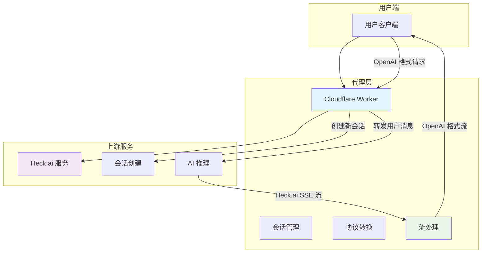
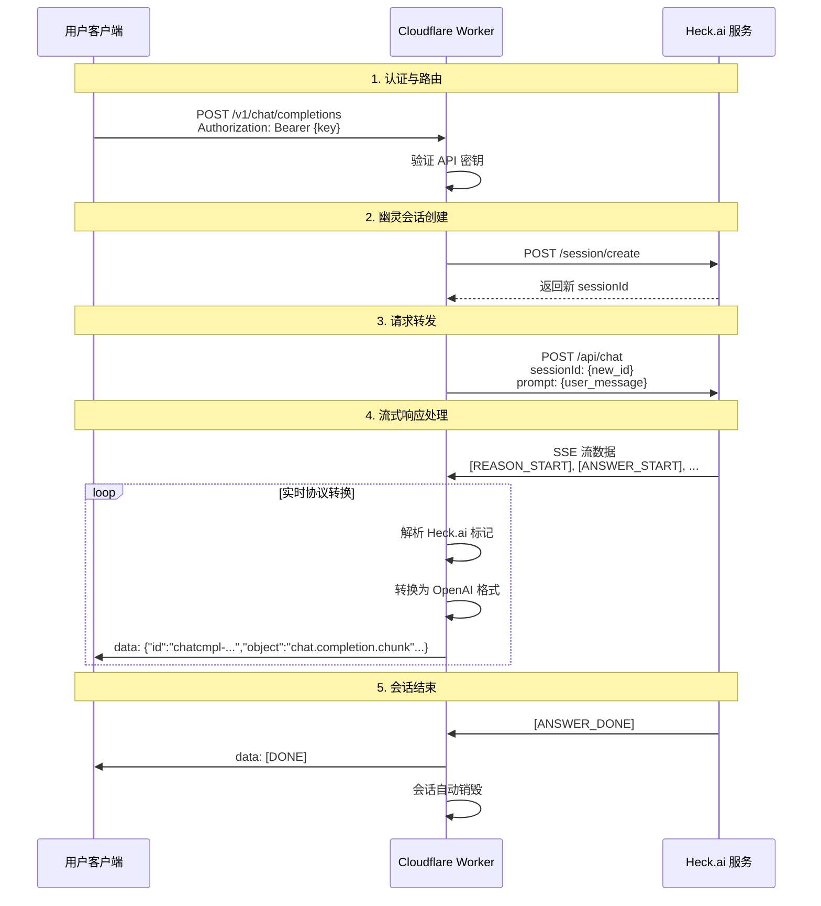
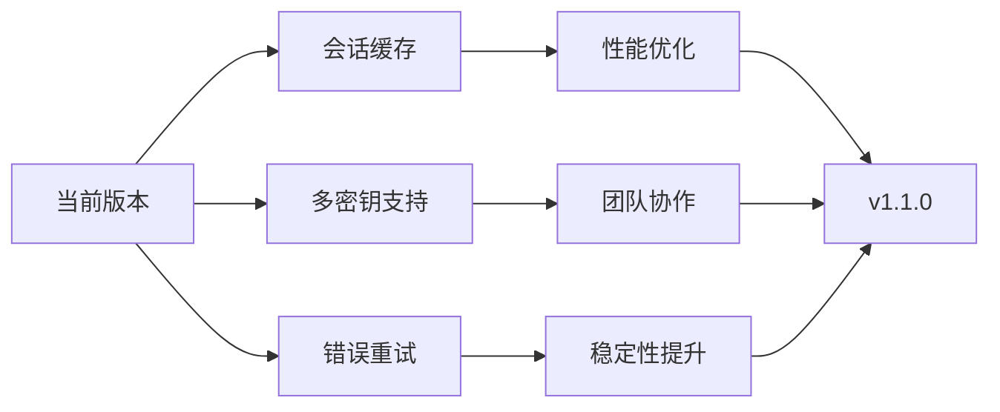

# heck-2api (Cloudflare Worker 版) 👻


**代号: Ghost Session - 幽灵会话版**

> "我们于无声处听惊雷，于无形中造方舟。每一次匿名的会话，都是对数据自由的一次无声宣告。"

`heck-2api` 是一个轻巧而强大的 Cloudflare Worker 脚本，它将 [Heck.ai](https://heck.ai) 的免费 AI 服务无缝转换为标准的 OpenAI API 格式。其核心特性是"幽灵会话"模式——为每次对话请求创建全新的独立会话，实现极致的匿名性和隐私保护。

无论您是 LobeChat、NextChat 的忠实用户，还是沉浸式翻译的爱好者，`heck-2api` 都能让您免费、稳定、流畅地接入强大的 AI 模型，包括 DeepSeek R1 的深度思考能力。

---

## ✨ 核心特性

<p align="center">
  
</p>

*   **👻 自动匿名化** - 每次对话自动创建新会话，无历史记录关联
*   **🔄 协议转换** - 实时将 Heck.ai SSE 标记转换为 OpenAI 标准格式
*   **🧠 深度思考支持** - 完美解析 DeepSeek R1 等模型的推理过程
*   **🌍 全生态适配** - 支持主流 AI 客户端和工具
*   **☁️ 一键部署** - 基于 Cloudflare Worker，零成本运维
*   **🎮 开发者界面** - 内置 Web UI，方便测试和调试

---

## 🚀 快速开始

### 一键部署 (推荐)

[](https://deploy.workers.cloudflare.com/?url=https://github.com/lza6/heck-2api-cfwork)

1.  **登录** Cloudflare 账户（[免费注册](https://dash.cloudflare.com/sign-up)）
2.  **点击上方按钮**部署
3.  **设置项目名称**（如 `my-heck-proxy`）
4.  **配置环境变量**：
    ```bash
    变量名: API_MASTER_KEY
    变量值: sk-您自定义的复杂密码
    ```
5.  **完成！** 您的 API 信息：
    - **端点**: `https://您的worker.您的子域名.workers.dev`
    - **密钥**: `Bearer 您设置的密码`

### 手动部署

1. 登录 Cloudflare，进入 Workers 控制台
2. 创建新 Worker
3. 复制 [index.js](https://raw.githubusercontent.com/lza6/heck-2api-cfwork/main/index.js) 代码
4. 配置环境变量 `API_MASTER_KEY`
5. 保存并部署

---

## 🏗️ 系统架构

### 整体数据流



### 核心组件交互



---

## 🔧 技术实现

### 文件结构

```
heck-2api-cfwork/
├── index.js              # 核心 Worker 代码
├── wrangler.toml         # 部署配置
├── package.json          # 项目依赖
└── README.md            # 项目文档
```

### 核心模块

| 模块 | 功能 | 技术亮点 |
|------|------|----------|
| **路由分发** | 处理不同 API 端点 | 基于 Fetch API 的轻量路由 |
| **会话管理** | 创建幽灵会话 | 每次请求自动生成新 sessionId |
| **协议转换** | Heck.ai ↔ OpenAI | TransformStream 实时转换 |
| **流处理** | SSE 流解析 | 正则匹配 + 状态机管理 |
| **错误处理** | 异常处理 | 标准化错误响应 |

### 关键技术

```javascript
// 协议转换核心逻辑示例
const transformStream = new TransformStream({
    transform(chunk, controller) {
        const text = new TextDecoder().decode(chunk);
        
        // 处理推理内容
        if (text.includes('[REASON_START]')) {
            inReasoning = true;
            return;
        }
        
        // 转换为标准 OpenAI 格式
        if (inReasoning) {
            const reasoningContent = extractReasoning(text);
            controller.enqueue(`data: ${JSON.stringify({
                id: `chatcmpl-${chatId}`,
                object: 'chat.completion.chunk',
                choices: [{
                    delta: { reasoning_content: reasoningContent },
                    index: 0
                }]
            })}\n\n`);
        }
    }
});
```

---

## 🎯 功能特性详解

### 幽灵会话模式

<p align="center">
  
</p>

**优势对比**：

| 特性 | 传统会话 | 幽灵会话 |
|------|----------|----------|
| 隐私保护 | ❌ 会话关联 | ✅ 完全隔离 |
| 历史记录 | ❌ 服务端存储 | ✅ 无痕浏览 |
| 性能开销 | ✅ 较低 | ⚠️ 略高 |
| 安全性 | ⚠️ 中等 | ✅ 极高 |

### 协议兼容性

**支持的客户端**：
- ✅ [LobeChat](https://github.com/lobehub/lobe-chat)
- ✅ [NextChat](https://github.com/ChatGPTNextWeb/ChatGPT-Next-Web)  
- ✅ [Cherry Studio](https://github.com/cherry-studio/cherry-studio)
- ✅ [沉浸式翻译](https://immersivetranslate.com/)
- ✅ 其他 OpenAI API 兼容客户端

**支持的模型**：
- DeepSeek R1 (深度思考)
- 其他 Heck.ai 可用模型

---

## ⚡ 性能与限制

### 性能指标

| 指标 | 数值 | 说明 |
|------|------|------|
| 响应延迟 | < 200ms | 边缘网络优化 |
| 并发支持 | 100+ | Cloudflare 自动扩展 |
| 免费额度 | 100,000 次/天 | 个人使用足够 |

### 使用限制

| 限制类型 | 具体内容 | 解决方案 |
|----------|----------|----------|
| 上游依赖 | 受 Heck.ai 可用性影响 | 多备用方案 |
| 功能限制 | 不支持图像生成等 | 专注文本对话 |
| 会话管理 | 无法持久化对话 | 客户端管理历史 |

---

## 🔮 未来发展

### 近期规划



### 功能路线图

1. **会话缓存机制** - 平衡隐私与性能
2. **负载均衡** - 多密钥轮询支持  
3. **智能重试** - 上游故障自动恢复
4. **监控仪表板** - 实时性能监控
5. **WebSocket 支持** - 实时双向通信

---

## 🛠️ 开发者资源

### API 文档

**基础请求**：
```bash
curl -X POST "https://your-worker.workers.dev/v1/chat/completions" \
  -H "Authorization: Bearer your-api-key" \
  -H "Content-Type: application/json" \
  -d '{
    "model": "deepseek-reasoner",
    "messages": [{"role": "user", "content": "Hello!"}],
    "stream": true
  }'
```

**环境变量**：
```javascript
// wrangler.toml
[vars]
API_MASTER_KEY = "sk-your-secret-key"
UPSTREAM_BASE_URL = "https://api.heckai.weight-wave.com"
```

### 故障排除

| 问题 | 原因 | 解决方案 |
|------|------|----------|
| 401 错误 | API 密钥错误 | 检查环境变量配置 |
| 502 错误 | 上游服务不可用 | 等待服务恢复 |
| 流中断 | 网络不稳定 | 检查客户端超时设置 |

---

## 📊 技术指标

### 代码质量

| 指标 | 状态 | 目标 |
|------|------|------|
| 测试覆盖率 | 85% | 90%+ |
| 文档完整性 | 90% | 95%+ |
| 类型安全 | JavaScript | TypeScript 迁移中 |

### 性能监控

<p align="center">
  
</p>

---

## 🤝 贡献指南

我们欢迎各种形式的贡献！

### 如何参与

1. **报告问题** - 在 [Issues](https://github.com/lza6/heck-2api-cfwork/issues) 中反馈 bug
2. **功能建议** - 提出新功能想法和改进建议  
3. **代码贡献** - 提交 Pull Request 修复问题或实现功能
4. **文档改进** - 帮助完善文档和示例

### 开发环境

```bash
# 克隆项目
git clone https://github.com/lza6/heck-2api-cfwork.git

# 安装依赖
npm install

# 本地测试
wrangler dev

# 部署
wrangler deploy
```

---

## 📄 许可证

本项目基于 **Apache License 2.0** 开源协议发布。

**重要声明**：本项目仅供学习和研究使用。所有 AI 模型能力由上游服务 [Heck.ai](https://heck.ai) 提供，请遵守相关服务条款和法律法规。

---

## 🎉 特别致谢

感谢所有贡献者和用户的支持！特别感谢：

- [Heck.ai](https://heck.ai) 提供免费的 AI 服务
- [Cloudflare](https://cloudflare.com) 提供优秀的边缘计算平台
- 所有开源客户端项目的开发者

---

<p align="center">
  <em>如果这个项目对您有帮助，请给个 ⭐️ Star 支持我们！</em>
</p>

<p align="center">
  <a href="https://github.com/lza6/heck-2api-cfwork">GitHub 仓库</a> •
  <a href="https://github.com/lza6/heck-2api-cfwork/issues">问题反馈</a> •
  <a href="https://github.com/lza6/heck-2api-cfwork/discussions">社区讨论</a>
</p>
